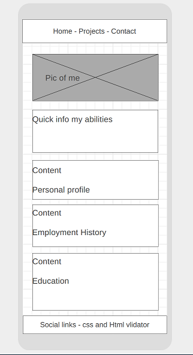

# Leah Portfolio Website
## Code Institute Milestone Project 1

## UX
### Project Goal
The primary goad is to create a website to display my abilities and strengths to a prospective employer, get hired.


#### User goals
* To find out what skills I have
* What are my qualifications
* Examples of my work
* Am I suitable for a post they need to fill
* Make contact with me
#### Required sections
* Home page containing brief overview and what area of emploment I am looking for.
* Projects page containing details of projects that I have completed.
* Contact page to send a message and make contact with me. 


## User stories

* As a recruiter I am looking for someone to fill various roles.
* As an employer I am searching for a new developer to work on a project.
* As a business owner I am checking previous experience of a potential employee after having received the website address on a CV.

## Design choices

My design choices are to make a professional looking site with a modern clean look. Simple navigation and easy access to required information on a range of devices.
## Wireframe
I have created wireframe views of the three pages that the site will have based on my required sections. I used wireframe.cc to complete this task.

### Home page

##### Mobile

---
##### Tablet

---
##### Laptop


### Projects Page

##### Mobile

---
##### Tablet

---
##### laptop

---

### Contact Page

##### Mobile

---
##### Tablet

---
##### Laptop

---

## Code

### Languages used
* HTML
* CSS
* php for the contact page reCAPTCHA code and email

### My Styles and Bootstrap Overrides

#### Navbar overrides to replace Bootstrap defaults
``` css

.navbar a {
    color: rgb(162, 42, 164);
}

.nav-pills {
	--bs-nav-pills-border-radius: 0.375rem;

	--bs-nav-pills-link-active-color: #fff;
    
	--bs-nav-pills-link-active-bg: rgb(162, 42, 164);
}
```
All my style rules are contained in the style.css file.

## Credits
All images are my own.
Music in the YouTube video is supplied as part of the user agreement to improve UX.

### Acknoledgements - Attribution

* Bootstrap
* Bootstrap documentation
* Google reCAPCHA
* Google reCAPCHA documentation

## Deployment

To deploy I use a GitHub action script from SamKirkland/FTP-Deploy-Action@4.3.0

* Created a secret in the repository FTP_PASSWORD
* Edit the script to point to my web host FTP server
* Test run carried out
* Check all files are uploaded

The script will run every time I push to master which means I can use my local environment for most of the testing while having an automated deployment system that is very simple.

Script code :
``` yml
on: push
name: Deploy website on push
jobs:
  web-deploy:
    name: Deploy
    runs-on: ubuntu-latest
    steps:
    - name: Get latest code
      uses: actions/checkout@v2
    
    - name: Sync files
      uses: SamKirkland/FTP-Deploy-Action@4.3.0
      with:
        server: ftp.hostmysite.wales
        username: githubftp@leah.wales
        password: ${{ secrets.ftp_password }}
        protocol: ftps
```


 

### How to run this project locally

* Set up a web host environment using LAMP / WAMP
* Copy all project files and folders into a virtual host location
* Enter the virtual host address in a web browser.
* reCAPTCH will not work locally as it is associated with the domain name. 

## Testing

https://developer.chrome.com/docs/lighthouse/overview/

All pages pass CSS and HTML validation

All links and navigation work correctly

Site works on mobile, tablet and laptop / desktop sized screens as expected.

Accessibility checks for screen readers, contrast and navigation.

### Bugs discovered


# Project Requirements Check From CI Project Brief

## Main Technologies

* Required: HTML, CSS

* Optional: Bootstrap and/or other CSS libraries/frameworks.

## Mandatory Requirements

A project violating any of these requirements will FAIL

* Static front end project: Write custom HTML5 and CSS3 code to create a website of at least 3 pages, or (if using a single scrolling page), at least 3 separate page areas.
* Information Architecture: Incorporate a main navigation menu and structured layout (you might want to use Bootstrap to accomplish this).
* Documentation: Write a README.md file for your project that explains what the project does and the value that it provides to its users.
* Version Control: Use Git & GitHub for version control.
* Attribution: Maintain clear separation between code written by you and code from external sources (e.g. libraries or tutorials). Attribute any code from external sources to its source via comments above the code and (for larger dependencies) in the README.
* Deployment: Deploy the final version of your code to a hosting platform such as GitHub Pages.

## Project Example Idea 3 
 External user’s goal:

* The site's users are recruiters considering to hire the applicant.

Site owner's goal:

* Present self in best light and get hired.

Potential features to include:

* Tell about educational history and work experience.

* Tell about skills and any other relevant competencies and interests.

* Provide basic personal information and contact information for recruiters.

Advanced potential feature (nice-to-have)

* Showcase portfolio of projects so far (in-lieu of links to real projects that you'd build later, feel free to include links to fake projects or random sites on the internet at this stage)

